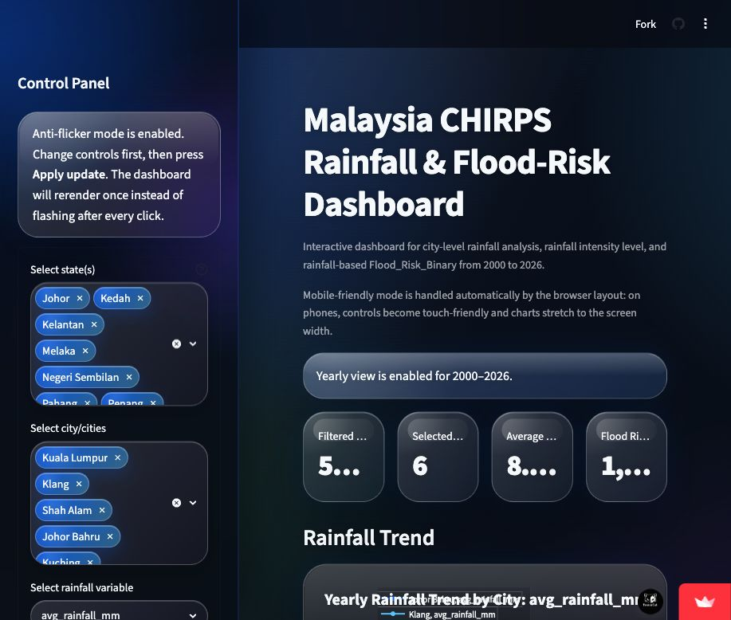
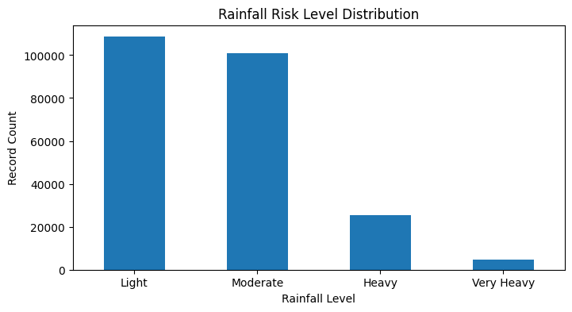
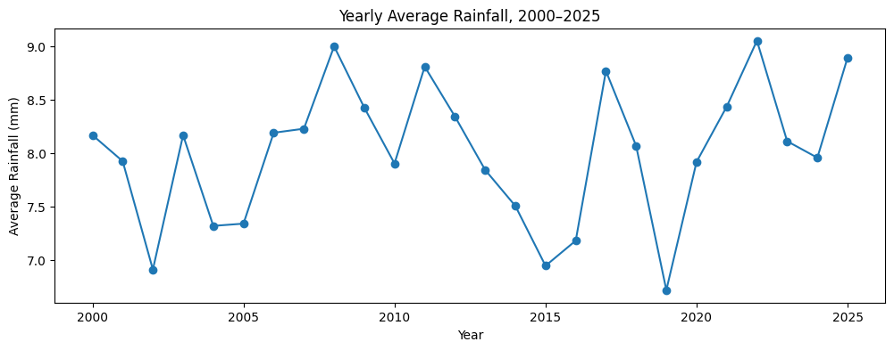
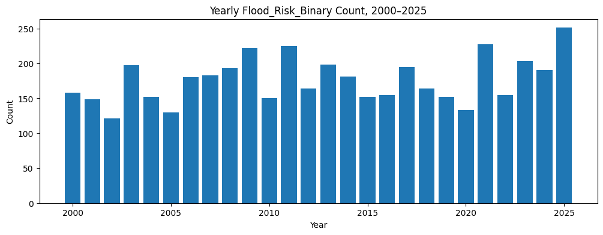
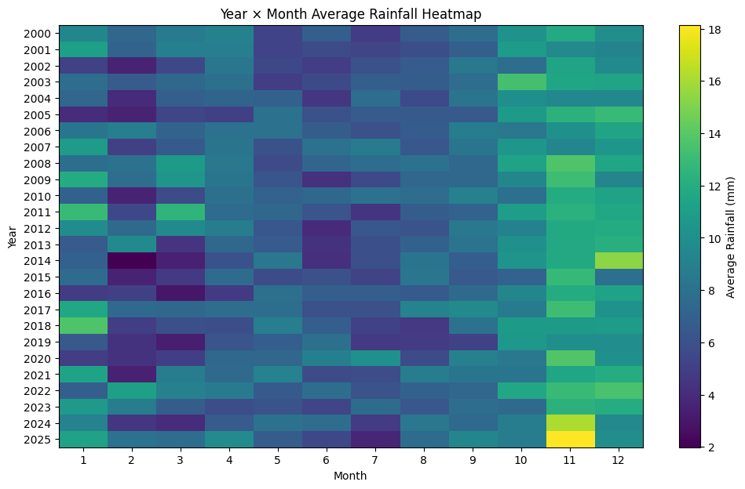
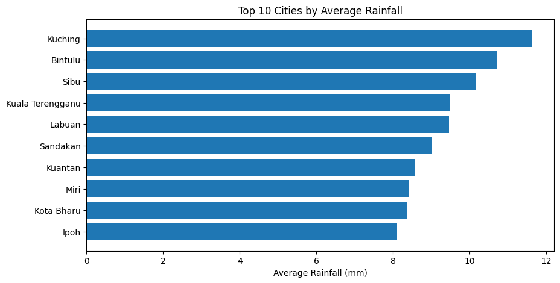
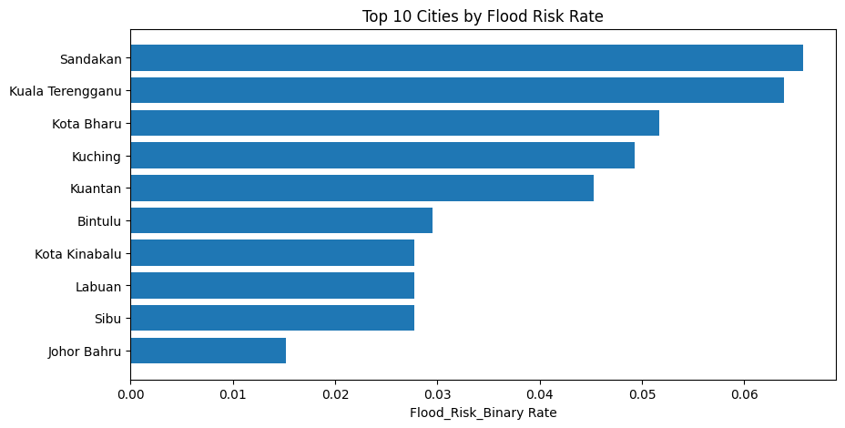
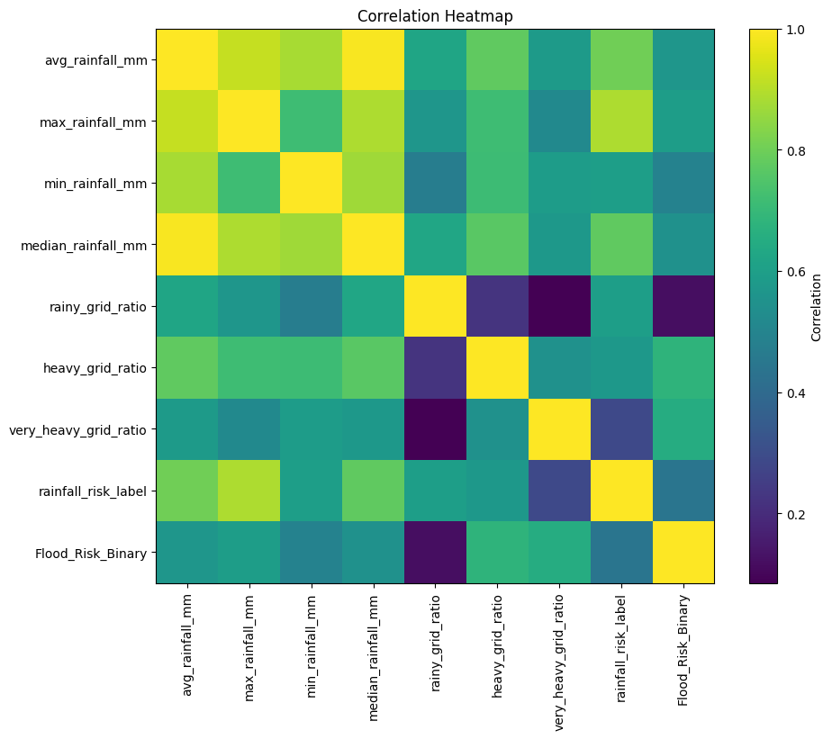
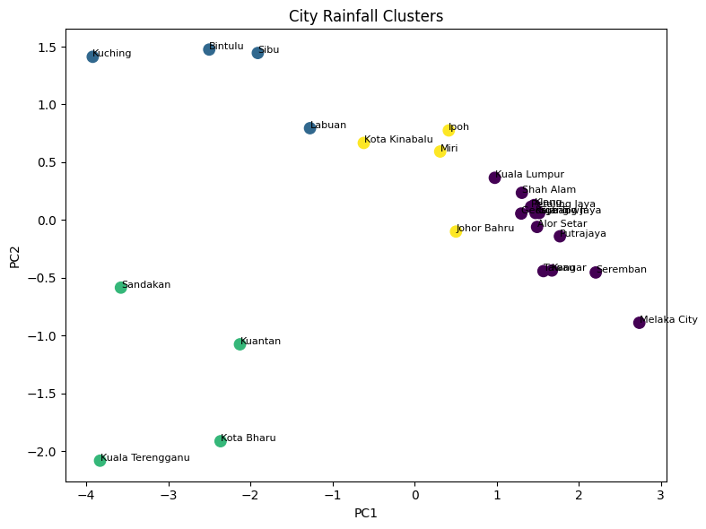
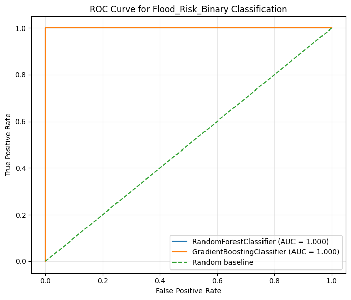

# Malaysia CHIRPS Rainfall and Flood-Risk Dashboard

Interactive Streamlit dashboard and analytics workflow for city-level rainfall and rainfall-based flood-risk signals across Malaysia from 2000 to 2026.

Live dashboard: https://malaysia-flood-rainfall-dashboard.streamlit.app



## Project Overview

This project analyzes CHIRPS daily rainfall data for 25 major Malaysian cities across 16 states and federal territories. The workflow converts gridded daily rainfall into city-level records, builds rainfall intensity labels, creates a rainfall-based `Flood_Risk_Binary` proxy, and presents the results through an interactive dashboard.

Important interpretation: `Flood_Risk_Binary` is a rainfall-based proxy, not an official flood occurrence record.

## Dataset Snapshot

| Item | Value |
| --- | --- |
| Source | CHIRPS daily gridded rainfall NetCDF |
| Period | 2000-01-01 to 2026-03-31 |
| Records | 239,675 city-day rows |
| Coverage | 25 cities, 16 states/federal territories |
| Main variables | average, maximum, minimum, median rainfall; rainy/heavy/very-heavy grid ratios |
| Mean daily average rainfall | 7.98 mm |
| Maximum city-level rainfall signal | 325.64 mm |
| Flood_Risk_Binary positive records | 4,658 |

The city extraction uses fixed city coordinates and a local radius buffer, then summarizes all CHIRPS grid cells inside each city radius.

## Methodology

### Data Construction

- Download yearly CHIRPS 2.0 daily NetCDF files for 2000-2026.
- Open yearly NetCDF files with `xarray`, detect rainfall/latitude/longitude/time variables, and convert daily gridded rainfall into city-level CSV rows.
- Use the haversine distance formula to select CHIRPS grid cells within each city's radius.
- For each city-day, compute rainfall summaries and grid ratios:
  - `avg_rainfall_mm`, `max_rainfall_mm`, `min_rainfall_mm`, `median_rainfall_mm`
  - `valid_grid_count`, `rainy_grid_count`, `heavy_grid_count`, `very_heavy_grid_count`
  - `rainy_grid_ratio`, `heavy_grid_ratio`, `very_heavy_grid_ratio`

### Rainfall Risk Proxy

The notebook uses public Infobanjir-style rainfall thresholds to create labels. The intensity signal is:

```python
signal = max(avg_rainfall_mm, max_rainfall_mm)
```

| Label | Rule |
| --- | --- |
| Light | `signal < 11` |
| Moderate | `signal >= 11` |
| Heavy | `signal >= 31` |
| Very Heavy | `signal > 60` |

`Flood_Risk_Binary = 1` when the rainfall label is Very Heavy. Otherwise, it is `0`.

## Exploratory Data Analysis

The companion notebook performs data quality checks, descriptive statistics, univariate analysis, temporal analysis, spatial/city comparison, and feature relationship analysis.

### Rainfall Risk Level Distribution



### Yearly Average Rainfall Trend



### Yearly Flood-Risk Signal Count



### Year by Month Rainfall Heatmap



### Top Cities by Average Rainfall



### Top Cities by Flood-Risk Rate



### Rainfall Feature Correlation



## Modeling and Algorithms

The notebook extends the EDA into dimensionality reduction, clustering, regression, classification, and time-series forecasting.

### PCA and City Clustering

- Standardize rainfall features.
- Use PCA to project rainfall behavior into lower-dimensional components.
- Cluster cities by long-term rainfall behavior with K-Means.
- Use GPU/MPS-aware PyTorch K-Means where available, with sklearn fallback.



### XGBoost Rainfall Regression

Target-specific XGBoost models predict continuous rainfall variables while avoiding leakage from risk labels:

| Target | Best trial | Test MAE | Test RMSE | Test R2 |
| --- | --- | ---: | ---: | ---: |
| `avg_rainfall_mm` | shallow_generalized | 1.923 | 3.401 | 0.908 |
| `max_rainfall_mm` | shallow_generalized | 4.175 | 6.152 | 0.872 |
| `min_rainfall_mm` | regularized | 1.046 | 2.511 | 0.879 |

### Flood_Risk_Binary Classification

Random Forest and Gradient Boosting classifiers are used to predict the binary rainfall-risk proxy. The notebook excludes `rainfall_risk_level`, `rainfall_risk_label`, and `Flood_Risk_Binary` from input features where they would cause label leakage.

| Model | Accuracy | Precision | Recall | F1 | ROC AUC |
| --- | ---: | ---: | ---: | ---: | ---: |
| RandomForestClassifier | 1.000 | 1.000 | 1.000 | 1.000 | 1.000 |
| GradientBoostingClassifier | 1.000 | 1.000 | 1.000 | 1.000 | 1.000 |



### PatchTST Time-Series Forecasting

The time-series section uses a PatchTST Transformer workflow for next-day rainfall forecasting:

- Inputs: previous daily rainfall sequence and seasonal/spatial features.
- Outputs: next-day `avg_rainfall_mm` and `max_rainfall_mm`.
- Split: train 2000-2020, validation 2021-2022, test 2023-2025, partial 2026 demonstration.
- Predicted rainfall is converted back into rainfall intensity and `Flood_Risk_Binary`.

PatchTST flood-risk proxy performance:

| Split | Accuracy | Precision | Recall | F1 |
| --- | ---: | ---: | ---: | ---: |
| validation_2021_2022 | 0.977 | 0.384 | 0.173 | 0.238 |
| test_2023_2025 | 0.976 | 0.450 | 0.181 | 0.259 |
| demo_2026_partial | 0.966 | 0.500 | 0.130 | 0.206 |

## Dashboard Features

The Streamlit dashboard turns the processed CSV into an interactive rainfall exploration tool:

- State and city filtering with an anti-flicker apply workflow.
- Rainfall variable selection for average, maximum, minimum, median, and grid-ratio features.
- Yearly, monthly, and daily aggregation.
- Static rainfall trend charts and animated timeline views.
- Rainfall share pie charts, flood-risk signal charts, city comparison bars, and city-month heatmaps.
- Map-based rainfall visualization and animation in the deployed version.
- Optional filtered data preview for auditing selected records.

## Repository Structure

```text
.
├── app.py
├── malaysia_chirps_2000_2026_city_rainfall_clean_eda.csv
├── requirements.txt
├── README.md
└── assets/
    ├── dashboard-overview.png
    └── analysis/
```

## Run Locally

```bash
python3 -m venv .venv
source .venv/bin/activate
pip install -r requirements.txt
streamlit run app.py
```

The app expects the processed CSV file to be located beside `app.py`:

```text
malaysia_chirps_2000_2026_city_rainfall_clean_eda.csv
```

## Notes and Limitations

- CHIRPS is daily gridded rainfall, not station-level hourly rainfall.
- City rainfall is approximated from nearby CHIRPS grid cells inside a radius buffer.
- `Flood_Risk_Binary` is a rainfall-intensity proxy, not an official flood-event label.
- 2026 is a partial year in the dataset and should not be compared directly as a full-year period.
- Future work should combine rainfall with official flood reports, river levels, drainage capacity, soil moisture, land cover, and exposure data.
